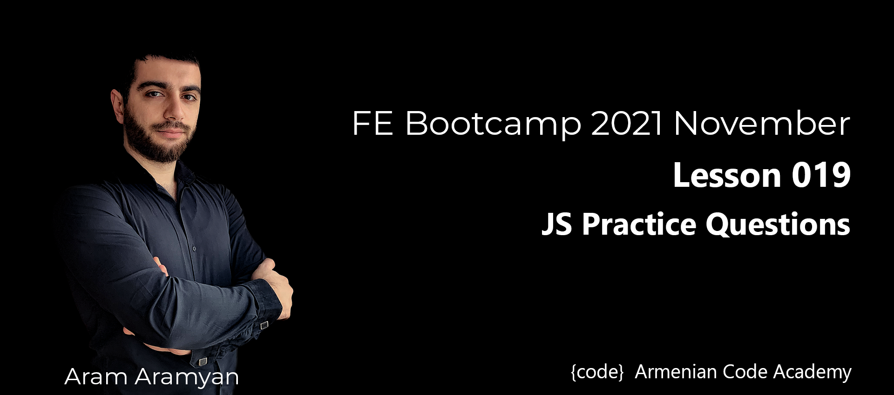

---
# JS Practice Questions

### Objects

* *Create an object which will have a date key.*

[**SOLUTION**](dateProperty.js)
___

### Functions
* *Return the sum of all arguments passed to function.*\
Example:

```js
f(1, 2, 3, 4); // returns 10
f(4, 7);       // returns 11
f(4);          // returns 4
```

[**SOLUTION**](sumOfAllArguments.js)

* *Create function that will return all the most repeated element.*

[**SOLUTION**](mostRepeated.js)

* *Let’s say we have an object with linked props:*

```js
let list = {
  value: 1,
  next: {
    value: 2,
    next: {
      value: 3,
      next: {
        value: 4,
        next: null
      }
    }
  }
};

```

*Print all the values with recursion.*


[**SOLUTION**](recursionPrint.js)

* *Implementation if Array.reduce( ) and Array.map( )*

[**SOLUTION**](implementations.js)

* *Write a function which will remove all repeated items of array.*

[**SOLUTION**](removeAllRepeated.js)

* *Write a JavaScript function that checks if the given string includes the given substring.*

```js
f("Hello", "ell"); // returns true
f("Kill", "lolo"); // returns false
```

[**SOLUTION**](includesSubstring.js)

* *Write a JavaScript function that accepts a string as a parameter and converts the first letter of each word of the string in the upper case.*

```js
f("i love you"); // returns "I Love You"
```

*use str.split( ) function.*

[**SOLUTION**](convertFirstToUpperCase.js)

* *Write a JavaScript function that accepts a string as a parameter and find the longest word within the string.*

```js
f("Web Development Tutorial"); // returns "Development"
```

[**SOLUTION**](longestWord.js)
___

### Extra Exercise

* *Write a JS function, which will work as a calculator.
  It will accept 3 arguments, first number, second number and the sign*

```js
calc(1, 2, "+"); // 3
calc(1, 2, "-"); // -1
calc(1, 2, "*"); // 2
calc(1, 2, "/"); // 0.5
```
[**SOLUTION**](calculator.js)